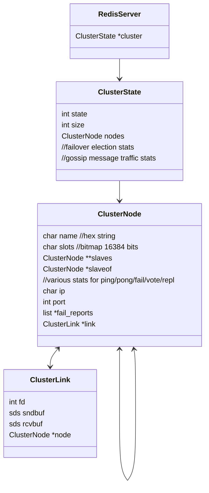

## Redis Cluster Overall

Redis Server processes in a redis cluster have their own message protocol and tcp peer socket network, constructed independently from redis command processing socket network. Therefore, there tcp socket port for cluster message communication is differently from redis process's dedicated port opened for redis clients (hiredis, jedis, ...)

### Class diagram



## Redis cluster major structures 


### Cluster State

This is a variable of redisServer to manage its view to the redis cluster state which includes all the redis nodes of the cluster, redis nodes in migration (from/to), failover stats, gossip message traffic stats, and action flag for cluster-before-sleep routine

```c
typedef struct clusterState {
    clusterNode *myself;  /* This node */
    uint64_t currentEpoch;
    int state;            /* REDIS_CLUSTER_OK, REDIS_CLUSTER_FAIL, ... */
    int size;             /* Num of master nodes with at least one slot */
    dict *nodes;          /* Hash table of name -> clusterNode structures */
    dict *nodes_black_list; /* Nodes we don't re-add for a few seconds. */
    clusterNode *migrating_slots_to[REDIS_CLUSTER_SLOTS];
    clusterNode *importing_slots_from[REDIS_CLUSTER_SLOTS];
    clusterNode *slots[REDIS_CLUSTER_SLOTS];
    zskiplist *slots_to_keys;
    //failover slave election stats
    ...
    /* Manual failover state in common. */
    mstime_t mf_end;            /* Manual failover time limit (ms unixtime).
                                   It is zero if there is no MF in progress. */
    /* Manual failover state of master. */
    clusterNode *mf_slave;      /* Slave performing the manual failover. */
    /* Manual failover state of slave. */
    long long mf_master_offset; /* Master offset the slave needs to start MF
                                   or zero if stil not received. */
    int mf_can_start;           /* If non-zero signal that the manual failover
                                   can start requesting masters vote. */
    /* The followign fields are used by masters to take state on elections. */
    uint64_t lastVoteEpoch;     /* Epoch of the last vote granted. */
    int todo_before_sleep; /* Things to do in clusterBeforeSleep(). */
    //gossip message traffic stats
    ...
} clusterState;

```

### Cluster Node

clusterNode has its own slot info via slot bitmap (16384 bits), its ip and port, its own clusterLink, ping/pong/repl time.

```c
typedef struct clusterNode {
    mstime_t ctime; /* Node object creation time. */
    char name[REDIS_CLUSTER_NAMELEN]; /* Node name, hex string, sha1-size */
    int flags;      /* REDIS_NODE_... */
    uint64_t configEpoch; /* Last configEpoch observed for this node */
    unsigned char slots[REDIS_CLUSTER_SLOTS/8]; /* slots handled by this node */
    int numslots;   /* Number of slots handled by this node */
    int numslaves;  /* Number of slave nodes, if this is a master */
    struct clusterNode **slaves; /* pointers to slave nodes */
    struct clusterNode *slaveof; /* pointer to the master node. */
    //various stats (ping/pong/fail/vote/repl_offset/orhan)
    ...
    char ip[REDIS_IP_STR_LEN];  /* Latest known IP address of this node */
    int port;                   /* Latest known port of this node */
    clusterLink *link;          /* TCP/IP link with this node */
    list *fail_reports;         /* List of nodes signaling this as failing */
} clusterNode;
```

### Cluster Link

clusterLink has a tcp socket file descriptor and socket buffer.

```c
typedef struct clusterLink {
    mstime_t ctime;             /* Link creation time */
    int fd;                     /* TCP socket file descriptor */
    sds sndbuf;                 /* Packet send buffer */
    sds rcvbuf;                 /* Packet reception buffer */
    struct clusterNode *node;   /* Node related to this link if any, or NULL */
} clusterLink;
```

### Cluster Message

clusterMsg is a message data structure used when exchanging messages between cluster peer nodes for cluster management, which has its own signature, message protocol version, message type, the sender node's name, sender node's slot bitmap, its master node name if its master exists, sender's tcp port, sender's view to the cluster state, cluster message flags, and cluster message data which differs from each other according to the message type

```c
typedef struct {
    char sig[4];        /* Siganture "RCmb" (Redis Cluster message bus). */
    uint32_t totlen;    /* Total length of this message */
    uint16_t ver;       /* Protocol version, currently set to 0. */
    uint16_t notused0;  /* 2 bytes not used. */
    uint16_t type;      /* Message type */
    uint16_t count;     /* Only used for some kind of messages. */
    uint64_t currentEpoch;  /* The epoch accordingly to the sending node. */
    uint64_t configEpoch;   /* The config epoch if it's a master, or the last
                               epoch advertised by its master if it is a
                               slave. */
    uint64_t offset;    /* Master replication offset if node is a master or
                           processed replication offset if node is a slave. */
    char sender[REDIS_CLUSTER_NAMELEN]; /* Name of the sender node */
    unsigned char myslots[REDIS_CLUSTER_SLOTS/8];
    char slaveof[REDIS_CLUSTER_NAMELEN];
    char notused1[32];  /* 32 bytes reserved for future usage. */
    uint16_t port;      /* Sender TCP base port */
    uint16_t flags;     /* Sender node flags */
    unsigned char state; /* Cluster state from the POV of the sender */
    unsigned char mflags[3]; /* Message flags: CLUSTERMSG_FLAG[012]_... */
    union clusterMsgData data;
} clusterMsg;

```
